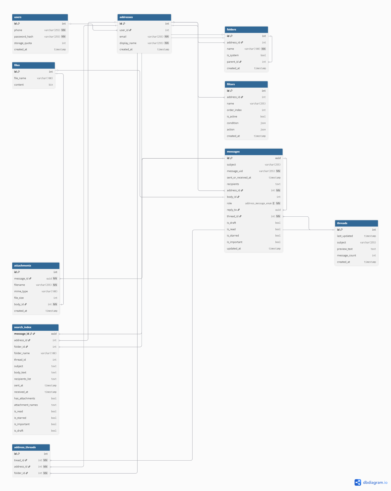
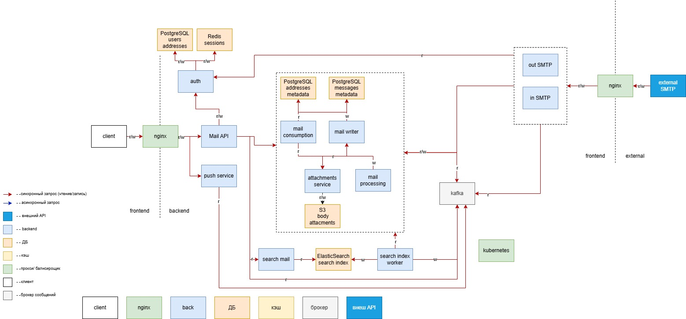

# Проектирование высоконагруженного аналога почты Mail.ru
## 1. Тема и целевая аудитория
### 1.1 Описание сервиса
Почта Mail.ru — проект компании, входящей в экосистему VK,
является одним из крупнейших в русскоязычном сегменте
интернета сервисов бесплатной электронной почты,
предоставляющим почтовые ящики на доменах mail.ru, internet.ru, list.ru, bk.ru, inbox.ru и др.

### 1.2 Целевая аудитория
- Количество пользователей в месяц(**MAU**): 48.5 млн за второй квартал 2025 [^1]
- Количество пользователей в день(**DAU**): 17.4 млн за первый квартал 2024 [^2]
- Географическое положение: Россия

### 1.3 Ключевой функционал сервиса
- Отправка/прием писем
- Организация папок, фильтрация почтового ящика
- Вложения писем и файлы
- Полнотекстовый поиск в письмах

### 1.4 Ключевые продуктовые решения
- Все письма и вложения хранятся на сервере
- Асинхронная доставка писем
- Полнотекстовый поиск по всем письмам
- Aнтиспам и безопасность писем
- Push уведомления

## 2. Расчет нагрузки

### 2.1 Данные полученные из источников
Полученные метрики из источника[^4]:
* 690 млн писем в будний день
* вложения писем 50 пб данные в двух копиях
* 3 371 тыс пушей в минуту
* 5 570 тыс запросов в минуту в MailApi (api для интерфейса и профиля)

### 2.2 Продуктовые метрики

## Сводная таблица продуктовых метрик
| Метрика                            |    Значение     | Источник                                             |
|:-----------------------------------|:---------------:|:-----------------------------------------------------|
| **MAU**                            |      48.5       | [^1]                                                 |
| **DAU**                            |      17.4       | [^2]                                                 |
| **Сессии (просмотр списка писем)** |    7 в день     | [^9]                                                 |
| **Получение писем**                |    20 в день    | [^6]                                                 |
| **Спам-письма**                    | 43% от входящих | [^10]                                                |
| **Письма с вложениями**            | 30% от входящих | [^7]                                                 |
| **Чтение писем**                   |    13 в день    | [^6]                                                 |
| **Отправка писем**                 |    2 в день     | [^6]                                                 |
| **Удаление писем**                 |    7 в день     | [^10]                                                |
| **Действия с папками/фильтрами**   |    2 в день     | Точных данных нет                                    |
| **Поиск по почте**                 |    2 в день     | Точных данных нет                                    |
| **Длительность хранения письма**   |  неограниченно  | Было найдено письмо за 2016 год                      |
| **Общее хранилище**                |     5.2 гб      | 65% от общего объема бесплатного хранилища 8 гб [^0] |
| **Тело письма**                    |      75 кб      | [^5]                                                 |
| **Вложение письма**                |      1 мб       | [^8]                                                 |
| **Кол-во писем**                   | 14 266 шт, 1гб  | [^7][^8]                                             |
| **Кол-во вложений**                | 4279 шт, 4.2 гб | [^7][^8]                                             |

### 2.3 Технические метрики

## Размер хранилища
| Метрика                    |      Значение       | Источник |
|:---------------------------|:-------------------:|:---------|
| **Общий размер хранилища** |        50 пб        | [^4][^8] |
| **Файлы**                  | 42.5 пб, 45*10^9 шт | [^4][^8] |
| **Письма**                 | 7.5 пб, 11*10^13 шт | [^4][^8] |

## Cетевой трафик
| Тип трафика     |             Суммарный суточный (Гбайт/сутки)              | Пиковое потребление в теченнии суток (в Гбит/с) k=2 | 
|:----------------|:---------------------------------------------------------:|:---------------------------------------------------:|
| **API**         |    17.4 млн * (20 * 75 кб + 20 * 0.3 * 1 мб) = 126 000    |        126 000 * 8 / (24 * 60 * 60) * 2 = 23        |
| **CDN**         |            17.4 млн / 7 * 15 мб * 0.9 = 33 000            |         33 000 * 8 / (24 * 60 * 60) * 2 = 3         |
| **Attachments** |             17.4 * (20 * 0.3 * 1мб) = 102 000             |        102 000 * 8 / (24 * 60 * 60) * 2 = 18        |
| **SMTP**        | 17.4 млн * (20 * 75 кб + 20 * 0.3 * 1.3 * 1 мб) = 157 000 |        157 000 * 8 / (24 * 60 * 60) * 2 = 29        |
| **IMAP/POP3**   |                  0.2 * 507 000 =  25 000                  |        25 000  * 8 / (24 * 60 * 60) * 2 = 4         |
| **Итог**        |                          442 000                          |                         77                          |

## RPS
RPS рассчитывается по формуле: **RPS = DAU * Действия в сутки / (24 * 60 * 60)**.

| Тип запроса                        | Средний RPS | Пиковый RPS (*k*=2) |
|:-----------------------------------|:------------|:--------------------|
| **Сессии (просмотр списка писем)** | 1 409       | 2 818               |
| **Получение писем**                | 4 027       | 8 054               |
| **Чтение писем**                   | 2 618       | 5 236               |
| **Отправка писем**                 | 402         | 3 100               |
| **Удаление писем**                 | 1409        | 2818                |
| **Действия с папками/фильтрами**   | 402         | 802                 |
| **Поиск по почте**                 | 402         | 802                 |
| **Итог**                           | 10 642      | 21 284              |

MailAPI имеет нагрузку 92 833 RPS [^4]

<!-- Это комментарий, он не 
будет виден при отображении -->

## 3. Глобальная балансировка нагрузки
### 3.1 Функциональное разбиение по доменам 
| Доменное имя      | Протокол | Назначение                           |
|-------------------|----------|--------------------------------------|
| **mail.ru**       | HTTPS    | Браузерные интерфейс, отдача статики |
| **api.mail.ru**   | HTTPS    | Основный API                         |
| **imap.mail.ru**  | IMAP/POP3 | Для сторонних клиентов               |
| **smtp.mail.ru**  | SMTP     | Обмен почтой с другими сервисами     |
| **media.mail.ru** | HTTPS    | Отдача вложений                      |

### 3.2 Обоснование расположения ДЦ
| Локация                          | Обслуживаемый регион | Назначение                   |
|----------------------------------|--------------------|------------------------------|
| **Москва**                       | Вся Россия         | Core сервер(API, работа с БД) |
| **Все города милионники России** | Вся Россия         | простой CDN                  |

Обоснование выбора: \
В Москве расположены все основные ДЦ и через нее проходит наибольшее кол-во трафика. 
Для увелечения скорости отдачи статики предлагается использовать CDN.
### 3.3 Распределение запросов по ДЦ 
Для статики CDN, для всех остальных запросов единственный ДЦ в МСК.
### 3.4 Схема балансировки
Так как ДЦ один глобальная балансировка не используется.

## 4. Локальная балансировка нагрузки

### Схема балансировки нагрузки
| Уровень                                          | Компонент/Технология                     | Механизм резервирования                                                                     | Формула резервирования               |
|--------------------------------------------------|------------------------------------------|---------------------------------------------------------------------------------------------|--------------------------------------|
| Вход в ДЦ                                        | Round Robin DNS                          | -                                                                                           | -                                    |
| Кластер балансировщиков                          | L7 Nginx                                 | Авторитетный DNS отключит упавший Nginx через TTL                                           | N+1                                  |

**Примечание**: \
Для балансировщиков выбрана N+1 формула резервирования, так надежность Nginx сопоставима с надежностью железа. 
### Расчет кол-ва балансировщиков
**Пиковый трафик**: 77 Гбит/c \
**Пиковый RPS**: 21 284 \
Если поставить сетевую карту на 100 Гбит/c на каждый nginx, то nginx с 16 ядрами будет иметь пропускную способность 88 Гбит/c. \
77 Гбит/c \ 88 Гбит/c = 0.875 c учетом резервирования N+1 нужно 2 балансировщика. \
Пусть на одно соединение приходиться 1 запрос, тогда пиковый CPS равен 21 284.
Один nginx на 16 ядрах способен выдерживать 6 675 CPS, следовательно, 21 284 / 6 675 = 3.18(4) c учетом резервирования N+1 нужно 5 балансировщиков. \
Значит общие **кол-во балансировщиков** = 5. 

## 5. Логическая схема БД 
### 5.1 Cхема БД

[сслыка на схему](https://dbdiagram.io/d/email_db-69c4167f78c6c4bc7a699bbd)
### 5.2 Таблица с описанием таблиц
| Таблица               | Описание                                               | Размер строки                                                                                                                        | Количество строк | Размер таблицы                           | Нагрузка на чтение (QPS, пик)           | Нагрузка на запись (QPS, пик)                                                |
|-----------------------|--------------------------------------------------------|--------------------------------------------------------------------------------------------------------------------------------------|------------------|------------------------------------------|-----------------------------------------|------------------------------------------------------------------------------|
| **`users`**           | Аккаунт пользователя                                   | id(8) + phone(255) + password_hash(255) + storage_quota(8) + created_at(8) = 534 Б                                                   | 0,250 млрд       | 534 Б × 250 000 000 = 133 ГБ             | 2 818                                   | 2 818 × 0,05 = 141                                                           |
| **`addresses`**       | Email-адреса (внутренние и внешние)                    | id(8) + user_id(8) + email(255) + display_name(255) + created_at(8) = 534 Б                                                          | 0,375 млрд       | 534 Б × 375 000 000 = 200 ГБ             | 2 818 + 8 054 + 5 236 + 802 = 16 910    | (3 100 + 6 443) × 0,1 = 9 543 × 0,1 = 954                                    |
| **`messages`**        | Метаданные письма                                      | id(8) + subject(255) + message_uid(255) + sent_at(8) + body_id(8) + reply_to(8) + thread_id(8) + is_draft(1) + created_at(8) = 543 Б | 110 млрд         | 543 Б × 110 000 000 000 = 54 ТБ          | 2 818 + 8 054 + 5 236 + 802 = 16 910    | 3 100 + 6 443 = 9 543                                                        |
| **`files`**           | Тело письма                                            | id(8) + content(76800) = 75 * 1024 + 8 = 76808 Б                                                                                     | 110 млрд         | 76808 Б × 110 000 000 000 = 7 684 ТБ     | 2 818 + 8 054 + 5 236 + 802 = 16 910    | 3 100 + 6 443 = 9 543                                                        |
| **`address_threads`** | Связь письма с адресами и ролями, а также папка письма | id(8) + message_id(8) + address_id(8) + role(1) + folder_id(8) + is_read(1) + is_starred(1) + is_important(1) + created_at(8) = 50 Б | 275 млрд         | 50 Б × 275 000 000 000 = 17 ТБ           | 2 818 + 8 054 + 5 236 = 16 108          | 3 100 × 3 + 6 443 = 9 300 + 6 443 = 15 743                                   |
| **`attachments`**     | Вложения писем (в размере учтен вес самого вложения)   | id(8) + message_id(8) + filename(255) + mime_type(100) + file_size(8) + file_id(8) + created_at(8) + file(1024²) = 651 Б             | 33 млрд          | 651 Б × 33 000 000 000 = 19 ТБ           | 5 236                                   | (3 100 + 6 443) × 0,3 = 9 543 × 0,3 = 2 863                                  |
| **`files`**           | Файл вложения                                          | id(8) + content(1024²) =  1 048 576 Б                                                                                                | 33 млрд          | 1 048 576 Б × 33 000 000 000 = 31 471 ТБ | 5 236                                   | (3 100 + 6 443) × 0,3 = 9 543 × 0,3 = 2 863                                  |
| **`folders`**         | Папки пользователей (системные и пользовательские)     | id(8) + user_id(8) + name(100) + is_system(1) + parent_id(8) + created_at(8) = 133 Б                                                 | 0,5 млрд         | 133 Б × 500 000 000 = 66 ГБ              | 802 × 0,25 + 2 818 = 200 + 2 818 = 3 018 | 802 × 0,75 = 602                                                             |
| **`threads`**         | Цепочки писем (диалоги)                                | id(8) + created_at(8) + last_message_at(8) = 24 Б                                                                                    | 55 млрд          | 24 Б × 55 000 000 000 = 1,3 ТБ           | 2 818 + 8 054 = 10 872                  | 3 100 + 6 443 × 0,3 = 3 100 + 1 933 = 5 033                                  |
| **`filters`**         | Правила фильтрации писем                               | id(8) + user_id(8) + name(255) + order_index(8) + is_active(1) + condition(256) + action(128) + created_at(8) = 672 Б                | 0,125 млрд       | 672 Б × 125 000 000 = 84 ГБ              | 802 × 0,8 + 8 054 = 642 + 8 054 = 8 696 | 802 × 0,2 = 160                                                              |
| **`search_index`**    | Индекс поиска                                          | id(8) + subject(255) + message_uid(255) + sent_at(8) + body_id(8) + reply_to(8) + thread_id(8) + is_draft(1) + created_at(8) = 543 Б | 110 млрд         | 543 Б × 110 000 000 000 = 54 ТБ          | 802                                     | 3 100 + 6 443 = 9 543                                                        |

### 5.3 Требования к конситентности
По отношению к отправителю все данные должны быть strict, чтобы при обновлении страницы изменения не могли пропасть. \
С точки зрения получателя письмо может дойти с задержкой(eventual), \
но если письмо уже дошло, то все что связанно с письмом(**`address_messages`**, **`attachments`**, **`threads`**  ) должно быть согласовано с ним(strict). 

**Strict**: **`users`**, **`addresses`**, для отправителя(**`messages`**, **`address_messages`**, **`attachments`**,  **`threads`**  ), \
изменения в фильтрах должны отображаться сразу(**`filters`** ), любые перемещения между папками должно отражаться сразу(**`address_messages`**), кроме получения письма. \
**Eventual**: для получателя группа письма в целом может дойти позже, но если пришла, должна быть согласована внутри группы(**`messages`**, **`address_messages`**, **`attachments`**, **`threads`**  )
### 5.4 Особенности распределения нагрузки по ключам
| Таблица               | Описание                                                                                                                                             |
|-----------------------|------------------------------------------------------------------------------------------------------------------------------------------------------|
| **`addresses`**       | Высокая нагрузка на запись из-за проверки уникальности email. Высокая нагрузка на чтение — практически все запросы требуют определения `address_id`. |
| **`messages`**        | Высокая нагрузка на чтение как на главный объект почты.                                                                                              |
| **`address_threads`** | Большая часть нагрузки приходится на ключ `address_id`.                                                                                              |
| **`attachments`**     | Умеренная нагрузка. Вложения скачиваются в основном один раз, письма с вложениями — в 30% случаев.                                                   |
| **`folders`**         | Низкая нагрузка. Папки добавляются редко.                                                                                                            |
| **`threads`**         | Без денормализации получение отсортированных писем в переписке требует больших затрат.                                                               |
| **`filters`**         | Низкая нагрузка на запись (редкие обновления). Высокая нагрузка на чтение — фильтры применяются к каждому входящему письму.                          |
## 6. Физическая схема БД
### 6.1 Cхема БД

### 6.2 Индексы
Индекс на primary key для каждой таблицы

| Таблица               | Поле                           | Тип индекса     | Обоснование                                                            |
|-----------------------|--------------------------------|-----------------|------------------------------------------------------------------------|
| **`users`**           | `phone`                        | B-Tree (UNIQUE) | Авторизация по телефону, уникальность                                  |
| **`addresses`**       | `email`                        | B-Tree (UNIQUE) | Поиск адреса при доставке и отправке и проверка при создании нового email |
|                       | `user_id`                      | B-Tree          | Получение всех адресов пользователя                                    |
|                       | `address_id`                   | B-Tree          | Получение всех писем пользователя                                      |
| **`attachments`**     | `message_id`                   | B-Tree          | Получение вложений письма                                              |
| **`address_threads`** | `folder_id`, `recived_at`      | B-Tree          | сортировка фильтрация                                                  |
| **`folders`**         | `user_id`, `name`, `parent_id` | B-Tree (UNIQUE, композитный) | Уникальность папки в пределах пользователя                             |
|                       | `user_id`                      | B-Tree          | Список пользовательских папок                                          |
| **`filters`**         | `address_id`,                  | B-Tree (композитный) | Применение  фильтров при доставке                                      |
| **`search_index`**    | `address_id`,                  | B-Tree          | Поиск для конкретного пользвателя                                      |

### 6.3 Денормализация
Хранить список получателей/отправителей сразу в **`messages`**, а также хранить `thread_id`.\
Добавить в **`message_folder`** время получения письма, чтобы не сортировать через **`messages`**.\
Добавить агрегированные поля для **`folders`**(кол-во писем, кол-во непрочитанных).\
Добавить в **`threads`** время последнего сообщения.\
Хранить в **`users`** кол-во занимаемой памяти.

### 6.4 Выбор СУБД
| Таблица                                                                                                              | СУБД                             | Обоснование                                        |
|----------------------------------------------------------------------------------------------------------------------|----------------------------------|----------------------------------------------------|
| `users`,  `addresses`,  `messages`,  `address_threads`,  `folders`,   `threads`,   `filters` | PostgreSQL                       | Нужны транзакции                                   | 
| `files`                                                                                                              | Объектное хранилище (S3 / MinIO) | Будут хранится вложения и тело писем               |
| `sessions`, `list_preview`,                                                                                          | Redis                            | Подходит для хранения временных сессий авторизации |
| `search_index`                                                                                                       | Elasticsearch                    | Подходит для поисковых индексов                    | 
| `addresses`                                                                                                          | Redis                            | поиск email по address_id                          | 
| `folders`                                                                                                            | Redis                            | агрегированные данные папок                        | 
| `events`                                                                                                             | Kafka/RabbitMQ                   | для асинхронной обработки доставки и уведомлений   | 

### 6.5 Шардирование и резервировние СУБД
Для всех основных SQL таблицы  шардирование по address_id, также каждый получатель/отправитель имеет свою копию **`message`** в своем шарде, \
а **`address_message`** только отношения пользователей своего шарда, что позволяет ходить на чтение в один шард,\
а также реализовать синхронные изменения для отправителя и асинхронное получение.  \
Каждый шард это один master и 2 slave бд, которых синхронная репликация, так как пользователь сразу должен видеть созданные изменения. \
Для файлов и кешей две копии. 

| Компонент                                        | Стратегия шардирования                                                                             | Репликация / Резервирование                              |
|--------------------------------------------------|----------------------------------------------------------------------------------------------------|----------------------------------------------------------|
| **`folders`**, **`filters`**,  **`attachments`** | По `address_id` (почтовый ящик)                                                                    | Каждый шард: 1 master + 2 replica, синхронная репликация |
| **`messages`**                                   | По `id`                                                                                            | Синхронная репликация внутри каждого шарда               |
| **`address_messages`**                              | По `address_id`, только локальные записи для участников шарда                                      | Синхронная репликация внутри шарда                       |
| **`threads`**                                    | По `address_id`                                                                                            | Синхронная репликация внутри шарда                       |
| **Файлы (тела писем, вложения)**                 | шардирование по bucket / ключу                                                                     | Две копии в разных стойках                               |
| **Кэш адресов (Redis)**                          | Шардирование по `address_id`                                                                       | Одна реплика                                             |
| **Сессии (Redis)**                               | Шардирование по ключу сессии                                                                       | Одна реплика                                             |
| **Поисковый индекс (Elasticsearch)**             | По `address_id` (пользовательские индексы)                                                         | Одна реплика                                             |

### Сопоставление индексов и ключей шардирования
| Таблица                | Индекс                                      | Ключ шардирования |
|------------------------|---------------------------------------------|-------------------|
| **`users`**            | `phone` (UNIQUE)                            | -                 |
| **`addresses`**        | `email` (UNIQUE), `user_id`, `id` (PRIMARY) | -                 |
| **`messages`**         | `id` (PRIMARY)                              | `id`              |
| **`address_messages`** | `address_id`, `folder_id`, `recived_at`     | `address_id`      |
| **`folders`**          | `address_id` , `name`, `parent_id` (UNIQUE) | `address_id`      |
| **`filters`**          | `address_id`                                | `address_id`      |
| **`attachments`**      | `message_id`                                | `message_id`      |
| **`search_index`**     | `address_id`                                | `address_id`      |
| **`threads`**          | `id` (PRIMARY)                              | `id`              |

| Операция          | Обоснование                                                                                                                            | Использованные ключи                              |
|-------------------|----------------------------------------------------------------------------------------------------------------------------------------|---------------------------------------------------|
| Папки пользователя | Идем в  **`folders`** по  `address_id`                                                                                                 | `address_id`                                      |
| Письма в папке    | Идем в **`address_messages`** по `address_id` и `folder_id` находим id писем сортируем по времени и флагу, далее поиск писем по шардам | `address_id` `folder_id` `recived_at` `message_id` |
| Построение треда  | Все письма в папке группируются по thread_id, далее находятся недостающие письма, далее письма сортируются по вложенности и времени    | `thread_id` `message_id` `recived_at`             |

### 6.6 Клиентские библиотеки / интеграции

| Компонент               | Библиотека                        |
|-------------------------|-----------------------------------|
| **PostgreSQL**          | `pgx` (Go)                        |
| **Redis**               | `go-redis`                        |
| **Elasticsearch**       | `go-elasticsearch`                |
| **Объектное хранилище** | `aws-sdk-go` / `minio-go`         |
| **Очереди**             | `confluent-kafka-go` / `rabbitmq` |

### 6.7 Балансировка запросов / мультиплексирование подключений

| Компонент               | Механизм                                                  |
|-------------------------|-----------------------------------------------------------|
| **PostgreSQL**          | PgBouncer перед шардами, клиентская балансировка чтения   |
| **Redis**               | Клиентская балансировка (consistent hashing в `go-redis`) |
| **Elasticsearch**       | Клиентская балансировка, реплики для чтения               |
| **Объектное хранилище** | Клиентская балансировка по эндпоинтам                     |

### 6.8 Схема резервного копирования
| Компонент                    | Технология резервирования                                |
|------------------------------|----------------------------------------------------------|
| **PostgreSQL** (каждый шард) | WAL‑архивация (каждые 15 мин) + ежедневный pg_basebackup |
| **Redis**                    | RDB snapshot (раз в сутки) + AOF                         |
| **Elasticsearch**            | Snapshot в S3 / MinIO (ежедневно)                        |
| **Объектное хранилище**      | Версионирование + cross‑region / cross‑AZ репликация     |
| **Очереди**                  | Репликация тем / очередей                                |

<!--  
При линейном треде все недоступные сообщение пропускаются, при построении графа возможен плейсхолдер удаленного или недоступного сообщения,
для определения причины хватит статуса удален в address_messages, тогда плейсхолдер будет различен
Возможна проблема оптимизации, пока тред не открыт полностью показывается последнее сообщение либо корень либо сообщение выбранное пользователем как главное,
для оптимизации нужно чтобы для показывания такого сообщения не нужно было строить весь тред сразу, а строить его только при открытии треда.
Решение: если пользователь удалил верхнее сообщение, то тогда бд выполняет оферхед для нахождения первого не удаленного(оценить оверхед).
-->
## 7. Алгоритмы

<!--  
Алгоритм хранения, представление и построения треда в почте.

### 7.1 Наименование алгоритма, метода или принятого подхода
Метод заключается в построении линейного или графого представления треда по таблице **threads**.

### 7.2 Наименование блока, подсистемы или функции, в которой алгоритм применяется
База данных PostgreSQL.

### 7.3 Постановка решаемой задачи
Обеспечения правильного построение треда и его превью с учетом ограничений.

### 7.4 Исходные данные, ограничения и требования к результату
**Таблицы в БД:** \
**threads**, **adddress_messages**, **messages**.  
**Ограничения:** \
Пользователь не должен видеть удаленные сообщения,
а также сообщения находящиеся в треде, но не адресованные ему.
Превью треда не должно требовать полное построение треда.
Обращение к любым полям таблицы должно использовать индексы или шардирование по этому полю для минимизации ресурсов на запросы к бд.
Не допускается использовать новые таблицы для хранения доп данных, а также сильная денормализация\
**Результат:** \
Дерево треда или линейное представление.
Сортировка в представлении по времени.
В древовидном представлении не должно быть пробелов и должны прослеживаться все связи треда.
проблема доступности сообщения для пользователя
Отдельная таблица адресов и сообщений слишком дорого по памяти
доставать из сообщения реципиентов.
Денормализация таблица tread_messages также хранит реципиентов
addresses->addresses_treads(cant update)->treads(can update)->treads_messages(can update)->message->addresses_messages(can update)->addresses
В треде и сообщении не может появится новый участник, но участник может удалить сообщение и больше не будет иметь к нему отношения
либо есть сообщение не отправленное пользователю, но оно есть в треде, который доступен пользователю.
Что будет если пользователь удалит все сообщения из треда он останется участником треда? 
-->
### Последовательность работы алгоритма

**Прeвью треда:**  
1. Получения списка `thread_id` из таблицы **address_threads** по `address_id` и `folder_id`.
2. Находим треды по `thread_id` в таблице **treads**, каждая запись содержит поля для превью треда,
которое обновляется локально для каждого пользователя.

**Построения треда:**  
1. Когда пользователь переходит в тред, находим все сообщения, доступные пользователю, в таблице **messages** по `thread_id`.
2. Получив список всех сообщения можно восстановить цепочку треда по полям `sent_or_received_at` и `replay_to`, если 
replay_to письмо недоступно пользователю(то-есть его нет в списке писем треда) frontend поставит вместо него заглушку-недоступное сообщение.

При древовидном представлении недоступные сообщения заменяются плейсхолдером при этом связь сохраняется и не возникают разрывы.

<!--  
### 7.6 Используемые структуры данных
Таблицы в БД: \
**threads**, **address_messages**, **messages**.

### 7.7 Рассматриваемые альтернативные решения

| Решение                                                       | Почему не было выбрано                                                                                     | 
|---------------------------------------------------------------|------------------------------------------------------------------------------------------------------------|
| Хранение в сообщение последнего сообщения треда               | Не позволяет сразу найти тред и его сообщения без рекурсии                                                 |
| Удаленные или недоступные сообщения отображаются пользователю | Несмотря на упрощение такое решение противоречить конфиденциальности сообщения и удобства восприятия треда |
| Хранить вместо `tread_id` корень треда                        | усложняет логику нахождения тредовых сообщений                                                             |

### 7.8 Обоснование выбора алгоритма и его параметров
Выбранное решение позволяет построить древовидное и линейное представление без пробелов, также удается шардировать таблицу **threads** по id.
Данное решение позволяет не строить тред полностью для представления превью.

-->
## 8. Технологии
### Сводная таблица
| Технология                               | Область применения                | Мотивационная часть                                                                                                                                                                                     |
|:-----------------------------------------|:----------------------------------|:--------------------------------------------------------------------------------------------------------------------------------------------------------------------------------------------------------|
| **React**                                | Frontend                          | Статическая типизация TypeScript снижает количество ошибок в коде, а компонентная модель React с виртуальным DOM эффективно обновляет список чатов и историю переписки без перерисовки всего интерфейса |
| **Go**                                   | Backend                           | Удобное распараллеливание задач, быстрота                                                                                                                                                               |
| **Nginx**                                | L7-балансировщик, SSL Termination | Отдача статики, балансировка, проксирование                                                                                                                                                             |
| **Kubernetes**                           | Оркестратор                       | Внутренняя балансировка, управление ресурсами(kub DNS, kube-proxy, kubelet)                                                                                                                             |
| **PostgreSQL**                           | Реляционная БД                    | ACID-транзакции                                                                                                                                                                                         |
| **Elasticsearch**                        | Поисковые индексы                 | Быстрый полнотекстовый поиск                                                                                                                                                                            |
| **Redis**                                | In memory хранилище               | In-memory хранилище для быстрого доступа к сессиям                                                                                                                                                      |
| **Kafka**                                | Брокер сообщений                  | Асинхронная доставка писем, уведомлений                                                                                                                                                                 |
| **SeaweedFS (S3-совместимое хранилище)** | Объектное хранилище               | Для хранения вложений и тел писем                                                                                                                                                                       |

## 8. Схема проекта 

[сслыка на схему](https://drive.google.com/file/d/1_-3SY_xUPn_gaXqJYc6vOP8bM6CVpLVM/view?usp=sharing)

| Сервис              | Назначение                                                          |
|:--------------------|:--------------------------------------------------------------------|
| auth                | Авторизация                                                         |
| Mail API            | Обработка API запросов поход в узкоспециализированные сервисы       |
| push service        | Пуш-уведомления                                                     |
| mail consumption    | Фильтрация и сборка писем                                           |
| mail writter        | Разбивает письмо на метаданные, тело, вложения, отношения с адресом |
| attachments service | обработка, сжатие файлов(тело писем, вложения, .eml)                |
| mail processing     | Проверка, обработка, фильтрация писем                               |
| search mail         | Сервис для обработки поисковых запросов                             |
| search index worker | Обновление индексов для поиска                                      |
| out SMTP            | Отдача, упаковка внешних писем                                      |
| in SMTP             | Прием, обработка внешних писем                                      |
<!--  
### Операции и путь сервисов
**Отправка внутреннего сообщения:**  
Client A -> nginx -> Mail API -> PostgreSQL  
|-> Kafka (internal_delivery)  

Kafka -> Mail Processing -> PostgreSQL  
|-> S3  
|-> ElasticSearch Worker -> ElasticSearch  
|-> Kafka (notification)  

Kafka -> Push Service -> Client B  
**Отправка внешнего сообщения:**  
Client A -> nginx -> Mail API -> PostgreSQL  
|-> Kafka (internal_delivery)

Kafka -> Mail Processing -> PostgreSQL  
|-> S3  
|-> ElasticSearch Worker -> ElasticSearch  
|-> Kafka (notification)

Kafka -> Push Service -> Client B
-->

Ссылки на источники:

[^0]: [mail.ru](https://mail.ru/)
[^1]: [Пресс-релиз VK по результатам за 2 кв. и 1 пол. 2025](https://vk.company.ru/ru/press/releases/12064/)
[^2]: [Пресс-релиз VK по результатам за 1 кв. и 1 пол. 2024](https://corp.vkcdn.ru/media/files/RUS_Press_Release_Q1_2024.pdf)
[^3]: [Вики про почту Mail.ru](https://ru.wikipedia.org/wiki/%D0%9F%D0%BE%D1%87%D1%82%D0%B0_Mail)
[^4]: [Архитектура Почты Mail.ru в цифрах](https://vkjt.ru/talks/f45576e5f9054109919a2bda80ed6f99/?referer=/#about)
[^5]: [Средний размер письма Тартуский университет](https://wiki.ut.ee/spaces/IT/pages/196185750/How+much+space+do+office+applications+take+up)
[^6]: [Метрики почты от сервиса Mailbird](https://www.getmailbird.com/email-use-statistics/?trk=article-ssr-frontend-pulse_little-text-block)
[^7]: [Процент вложений mail почты ](https://my.mail.ru/community/mailru/multipost/1C0C0000D1EED800.html)
[^8]: [Статья про хранилище почты](https://rss1.smashingmagazine.com/2017/01/reducing-email-storage-mailru/#comments-reducing-email-storage-mailru)
[^9]: [Отчет от ZeroBounce](https://www.zerobounce.net/email-statistics-report?hubs_content=www.hubspot.es/products/crm/b2b&hubs_content-cta=cl-dropdown-menu-link&utm_campaign=Scamadviser.com&utm_medium=Scamadviser.com&hubs_post=blog.hubspot.es/sales/mejor-crm-coaching-empresarial&hubs_post-cta=es-blog-sticky)
[^10]: [Процент спама Касперский](https://securelist.com/spam-and-phishing-report-2025/118785/)
